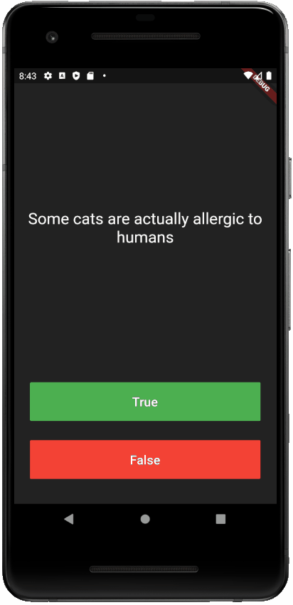

# Quizzler ❓

This is a Flutter app I worked on following the starter code from the [Flutter Udemy course by Angela Yu](https://www.udemy.com/course/flutter-bootcamp-with-dart/).

Quiz yourself on thirteen questions. (Oooo, the unlucky thirteen. We should have picked some other number of questions.)

## Skills Learned

* Pillars of OOP
  * Abstraction
  * Encapsulation
  * Inheritance
  * Polymorphism
* Named constructors in Dart
* [rFlutter Alert Package](https://pub.dev/packages/rflutter_alert)

## Screenshot

